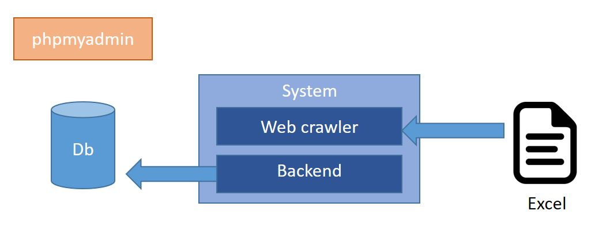

# document-management-system
> flask based Document management system

This system is in charge of storing the post title and contents which collected by web crawler.

## System structure
The system is composed of three components:
- System backend
- Database
- phpmyadmin




## Run the system
To run, please refer to the command below:
```bash
# Using docker-compose
docker-compose build --no-cache
docker-compose up
```

## Import the data
1. To import the data, please enter the system container first:
```bash
# Using docker-compose
docker-compose exec system sh
```

2. Insert the data with flask cli script
```bash
# Using flask cli
flask test_insert_doc --excel_path [EXCEL-PATH]
```

## Show the data
Check the data stored in the database with browser
```
http://[HOST]:8880/check
```